# Relay — Architecture Overview

> **Purpose:** the hero diagram — what Relay's moving parts are and how traffic flows through them.
> Zoom level: deployment topology. For abstraction levels see [Context](../Context%20Diagram/context-diagram.md) and [Container](../Container%20Diagram/container-diagram.md) diagrams.

## Diagram

> Palette tuned for **GitHub dark mode** (dark fills, luminous strokes). GitHub re-renders Mermaid per color scheme but `classDef` colors are hardcoded — so the palette is chosen to read well on dark canvases. Preview at [mermaid.live](https://mermaid.live) with the dark background enabled.

```mermaid
flowchart TB
%% ==================== ACTORS ====================
    subgraph Actors["Actors"]
        direction LR
        G(["Guest"]):::actor
        FU(["Free User"]):::actor
        PU(["Pro User"]):::actor
        AD(["Admin"]):::actor
    end

%% ==================== CLIENT ====================
    subgraph ClientL["Client"]
        WEB["Angular SPA<br>(Bootstrap, i18n AR/EN/FR/ES/DE)"]:::client
    end

%% ==================== EDGE ====================
    subgraph Edge["Edge"]
        NGINX[/"nginx<br>Angular static build"/]:::edge
        LB(("Load<br>Balancer")):::edge
    end

%% ==================== APP TIER ====================
    subgraph App["App Tier"]
        API["Spring Boot API xN<br>+ Spring Batch jobs (purge, analytics)<br>stateless — scales horizontally"]:::app
    end

%% ==================== DATA TIER ====================
    subgraph Data["Data Tier"]
        direction LR
        PG[("PostgreSQL 18<br>source of truth")]:::data
        RD[("Redis<br>cache + rate limits<br>eviction-only TTL")]:::data
        OBJ[("Object Storage<br>MinIO / S3<br>attachments")]:::data
    end

%% ==================== EXTERNAL SYSTEMS ====================
    subgraph Ext["External Systems"]
        direction LR
        KC("Keycloak 26<br>auth, own sessions"):::ext
        PAY("Payment Providers<br>Stripe · Fawry · Paymob/Opay"):::ext
        SMTP("Email / SMTP<br>verification · reset · invoices"):::ext
    end

    KCDB[("Keycloak DB<br>Keycloak-managed")]:::extdb

%% ==================== CONNECTIONS ====================
    %% actors -> client
    G --> WEB
    FU --> WEB
    PU --> WEB
    AD --> WEB

    %% two entry doors
    WEB -- "static assets" --> NGINX
    WEB -- "HTTPS" --> LB

    %% scaling door
    LB --> API

    %% auth paths
    WEB -- "Login redirect" --> KC
    API -- "validate JWT (sub claim)" --> KC

    %% data tier
    API -- "notes · links · subs · reports" --> PG
    API -- "hot notes · rate-limit counters" --> RD
    API -- "attachment put/get (authorized proxy)" --> OBJ

    %% payments: two directions matter
    API -- "create checkout" --> PAY
    PAY -- "payment webhooks (idempotent)" --> API

    %% email
    API -- "transactional email" --> SMTP

    %% keycloak owns its storage
    KC -.-> KCDB

%% ==================== STYLING ====================
%% Palette tuned for GitHub dark mode — dark fills, luminous strokes, light text
    classDef actor fill:#172554,stroke:#60A5FA,stroke-width:2px,color:#DBEAFE
    classDef client fill:#2E1065,stroke:#A78BFA,stroke-width:2px,color:#EDE9FE
    classDef edge fill:#451A03,stroke:#FBBF24,stroke-width:2px,color:#FEF3C7
    classDef app fill:#052E16,stroke:#4ADE80,stroke-width:2px,color:#DCFCE7
    classDef data fill:#3B0764,stroke:#C084FC,stroke-width:2px,color:#F3E8FF
    classDef ext fill:#1E293B,stroke:#94A3B8,stroke-width:2px,color:#E2E8F0
    classDef extdb fill:#111827,stroke:#6B7280,stroke-width:1px,color:#9CA3AF,stroke-dasharray:4

    style Actors fill:#0B1220,stroke:#334155
    style ClientL fill:#0B1220,stroke:#334155
    style Edge fill:#0B1220,stroke:#334155
    style App fill:#0B1220,stroke:#334155
    style Data fill:#0B1220,stroke:#334155
    style Ext fill:#0B1220,stroke:#334155

    linkStyle default stroke:#64748B,stroke-width:1.5px
```

## Legend

| Shape | Meaning |
|---|---|
| `([stadium])` | Human actor |
| `[rectangle]` | Component you build/deploy |
| `[(cylinder)]` | Data store |
| `((double circle))` | Routing infrastructure |
| `(rounded)` | Third-party system |
| solid arrow | Synchronous request path |
| dotted arrow | Background / owned-storage relationship |

## Request paths

**Read path (hottest):**
Browser → LB → Spring Boot → Redis cache hit → response.
On cache miss: Postgres load → access re-evaluated (`deleted > removed > expired > privacy/password`) → cache fill with `PEXPIREAT` = note expiry.

**Write path:**
Browser → LB → Spring Boot → Postgres commit → cache invalidation (versioned keys, post-commit) → MinIO write (attachments).

**Auth path:**
Browser → Keycloak (login UI, PKCE) → JWT issued → Angular sends `Authorization: Bearer` → Spring Boot validates signature + `sub` claim. Keycloak sessions never touch Redis.

## Decisions encoded here (spec refs)

| Choice | Reference |
|---|---|
| LB fronts backend instances only — horizontal scaling | NFR-02, §6.1 |
| Static SPA served by nginx (CDN-ready) | NFR-05 |
| Redis = cache + rate-limit storage, eviction-only TTL, never the expiry authority | D-15, D-16, AC-06-07/08 |
| Attachments in dedicated object store, authorized downloads only | D-14, AC-15-05 |
| Keycloak external, owns its sessions and its DB | §6.1, NFR-10 |
| Payment webhooks inbound + idempotent | NFR-08 |
