# Relay — Container Diagram (C4 Level 2)

> **Purpose:** zoom inside the Relay box from the [Context diagram](../Context%20Diagram/context-diagram.md) — the individually runnable units ("containers") and the exact protocol each conversation uses.
> Deployment topology (LB, nginx) lives in the [Architecture Overview](../Architecture%20Diagram/architecture-overview.md); this level is about software units, not servers.

## Diagram

```mermaid
flowchart LR
%% C4 L2 — containers = individually runnable apps/data stores (NOT Docker containers)
%% Layout hint: grouped subgraphs = clean columns; edge labels = protocol only (details in prose)
    subgraph B["Relay — system boundary"]
        SPA["Angular SPA<br>Angular 22 · Bootstrap<br>runs in the browser"]:::ui
        API["Spring Boot API<br>Spring Boot 4.1 · stateless xN<br>+ Spring Batch jobs"]:::core

        subgraph S["Data"]
            direction TB
            PG[("PostgreSQL 18<br>source of truth")]:::data
            RD[("Redis<br>cache · rate limits")]:::data
            OBJ[("Object Storage<br>MinIO / S3 · attachments")]:::data
        end
    end

    subgraph X["External Systems"]
        direction TB
        KC("Keycloak<br>identity · social login"):::ext
        PAY("Payment Providers<br>Stripe · Fawry · Paymob/Opay"):::ext
        SMTP("Email Service"):::ext
    end

    SPA -- "1 · HTTPS REST" --> API
    API -- "3 · JDBC" --> PG
    API -- "4 · RESP" --> RD
    API -- "5 · S3 API" --> OBJ
    SPA -- "2 · OIDC PKCE" --> KC
    API -- "6 · JWKS" --> KC
    API <--->|"7 · checkout / webhooks"| PAY
    API -- "8 · SMTP" --> SMTP

%% Palette tuned for GitHub dark mode — matches Architecture Overview
    classDef ui fill:#2E1065,stroke:#A78BFA,stroke-width:2px,color:#EDE9FE
    classDef core fill:#052E16,stroke:#4ADE80,stroke-width:3px,color:#DCFCE7
    classDef data fill:#3B0764,stroke:#C084FC,stroke-width:2px,color:#F3E8FF
    classDef ext fill:#1E293B,stroke:#94A3B8,stroke-width:2px,color:#E2E8F0

    style B fill:#0B1220,stroke:#334155
    style S fill:#12081F,stroke:#334155
    style X fill:#0B1220,stroke:#334155

    linkStyle default stroke:#64748B,stroke-width:1.5px
```

## How to read it

- **Container** here means *individually runnable unit* (app or data store) — a C4 term that predates and differs from Docker containers.
- **Green box** = your code. **Purple cylinders** = state you own. **Gray boxes** = someone else's software, same as L1.
- **Every arrow now carries a protocol** — L1 answered *why* systems talk; this level answers *how*. If you can't label the protocol, the relationship isn't understood yet.
- **No LB / nginx** — deployment topology, already captured in the Architecture Overview. The SPA appears as the browser-resident app itself.
- **Spring Batch lives inside the API box** — same JVM, `@Scheduled` jobs; drawing it separately would imply a second deployable.

## Edge legend — what goes where

| # | From → To | Protocol | Purpose | Spec |
|---|---|---|---|---|
| 1 | SPA → API | HTTPS · REST JSON | All app traffic; access rules server-enforced | NFR-13 |
| 2 | SPA → Keycloak | OIDC redirect, PKCE | Login/registration in Keycloak UI, public client | FR-01, §6.1 |
| 3 | API → PostgreSQL | JDBC | Source of truth; `expires_at` vs DB clock = expiry authority | D-16, AC-06-07 |
| 4 | API → Redis | RESP | Hot note cache + rate-limit counters; eviction-only TTL (`PEXPIREAT`) | D-15, D-16, AC-06-08 |
| 5 | API → Object Storage | S3 API | Attachment put/get, authorized backend calls only | D-14, AC-15-05 |
| 6 | API → Keycloak | JWKS | Local JWT signature validation (keys fetched & cached) | NFR-10 |
| 7 | API ↔ Payment Providers | HTTPS (provider APIs) | Checkouts out · idempotent webhooks in — single arrow, both directions | FR-08, NFR-08 |
| 8 | API → Email | SMTP | Verification, password reset, grace reminders, invoices | AC-01-02/03, AC-08-06/07 |

> **Reading tip:** when one node has many connections (the API here), numbered edges keep the picture uncluttered — trace the number to this table. This is the standard trick for hub-and-spoke density in any diagramming tool.
