# Relay — System Context (C4 Level 1)

> **Purpose:** zoom level 1 of the C4 model — Relay as ONE box, its users, and the third-party systems it depends on.
> **Boundary rule:** no internals at this altitude. No LB, no Redis, no databases, no object storage — infrastructure appears at [Container level](../Container%20Diagram/container-diagram.md); deployment topology lives in the [Architecture Overview](../Architecture%20Diagram/architecture-overview.md).

## Diagram

```mermaid
flowchart LR
%% C4 L1 semantics rendered with flowchart engine (native C4Context renderer overlaps text)
    subgraph People["People"]
        direction TB
        G(["Guest<br>anonymous visitor"]):::actor
        FU(["Free User<br>max 5 notes · 1KB · 10MB"]):::actor
        PU(["Pro User<br>unlimited · 1MB · 50MB · short links"]):::actor
        AD(["Admin<br>moderation · content · analytics"]):::actor
    end

    RELAY["Relay<br>create · store · share notes<br>via unique links"]:::system

    subgraph Ext["External Systems"]
        direction TB
        KC("Keycloak<br>identity · verification · social login"):::ext
        PAY("Payment Providers<br>Stripe · Fawry · Paymob/Opay"):::ext
        SMTP("Email Service<br>verification · reset · invoices"):::ext
    end

    G -- "views & unlocks notes" --> RELAY
    FU -- "creates notes, free tier" --> RELAY
    PU -- "notes + short links + subscription" --> RELAY
    AD -- "moderates & manages content" --> RELAY

    RELAY -- "delegated auth, OIDC / JWT" --> KC
    RELAY -- "checkouts & payment webhooks" --> PAY
    RELAY -- "transactional email" --> SMTP

%% Palette tuned for GitHub dark mode — matches Architecture Overview
    classDef actor fill:#172554,stroke:#60A5FA,stroke-width:2px,color:#DBEAFE
    classDef system fill:#052E16,stroke:#4ADE80,stroke-width:3px,color:#DCFCE7
    classDef ext fill:#1E293B,stroke:#94A3B8,stroke-width:2px,color:#E2E8F0

    style People fill:#0B1220,stroke:#334155
    style Ext fill:#0B1220,stroke:#334155

    linkStyle default stroke:#64748B,stroke-width:1.5px
```

## How to read it

- **Left: people** — the four roles from spec §5. Arrow labels state *what each uses Relay for*, mirroring the permissions table.
- **Center, green: Relay** — the entire system you are building, drawn as ONE box with a heavier border (the C4 "subject system" convention). Everything inside it is invisible here by design.
- **Right: external systems** — software you integrate with over APIs but don't write or deploy (gray boxes).
- **Why no object storage / Postgres / Redis?** They are infrastructure Relay deploys itself (Container level), not third-party API integrations. External = someone else operates it.
- **Syntax note:** native `C4Context` Mermaid was replaced by a flowchart carrying C4 conventions — the official C4 renderer overlaps labels badly at this size; semantics are identical.

## Relationships → spec references

| Relationship | Reference |
|---|---|
| Guest views/unlocks without account | FR-04 AC-04-05, FR-03 |
| Free tier limits | FR-07, §9.1 |
| Pro entitlements + subscription management | FR-08 |
| Admin moderation & content tools | FR-10, FR-11, FR-14 |
| Keycloak owns all auth flows incl. 4 social logins | FR-01, §6.1, NFR-10 |
| Payments: checkout out, webhooks in | FR-08, §12, NFR-08 |
| Transactional email (verify/reset/reminders/invoices) | AC-01-02/03, AC-08-06/07 |
