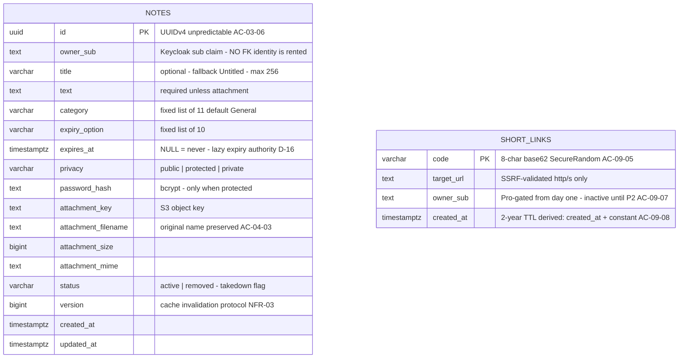

# Relay — Entity Relationship Diagram

> **Purpose:** the data contract your backend code must obey — entities, columns, cardinality.
> **Scope:** Ultra-strict **V1 = `NOTES` + `SHORT_LINKS` only** (signed off). Everything else arrives in later migrations — see the deferred table below.

## Diagram

## How to read it

- **Zero hard FKs in V1.** Both tables connect to identity only through soft `owner_sub` strings — there is deliberately nothing to reference.
- **No USERS / ADMINS tables.** Identity lives in Keycloak; Relay stores opaque `sub` claims. "Admin" is a realm role checked on the JWT (AC-10-08), never a row. Consequence: account deletion = delete Keycloak account + cascade local rows by `owner_sub` (Account Deletion sequence diagram).
- **No crow's feet yet** — the first real relationship (`REPORTS.note_id`) arrives with the moderation tables in P3.
- **No hard deletes** except creator/purge: takedown flips `status='removed'`; expiry computed from `expires_at` at read time; physical purge 90 days after expiry (D-17).

## Scope decision — what ships when (signed off)

| Artifact | Requirement | Migration |
|---|---|---|
| `NOTES`, `SHORT_LINKS` | FR-02..07, FR-09, FR-15 | **V1 — this diagram** |
| `subscriptions` | FR-08 Pro state machine | V2 (P2) |
| `invoices` | AC-08-07 Egyptian tax receipts | V2 (P2) |
| `processed_events` (webhook idempotency) | NFR-08 anti-double-charge | V2 (P2) |
| `reports` + admin queue | FR-10 · ⚠ viewer report button is AC-04-04 (P1, FR-04) — ship them together or accept no intake until P3 | V-next (P3) |
| `analytics_events` + rollups | FR-14 · ⚠ visit history starts only when this lands | V-next (P3) |
| `audit_log` | AC-10-02 logged admin bypass | P3 |
| `cms_pages`, contact submissions | FR-11, D-06 | P3 |
| Per-user locale/theme prefs | AC-12-03, AC-13-02 — resolve as **Keycloak user attributes**, keeping identity data in its one home | P3 |

> Blind-review drafts from 5 independent agent passes live in [`drafts/`](drafts/) — consulted for this roadmap; end-state gaps captured above.

## Column decisions → spec references

| Decision | Reference |
|---|---|
| `expires_at` nullable, DB-clock authority, Redis TTL mirrors it | D-16, AC-06-07/08 |
| `version` column: edit bumps version in-transaction → failed cache DEL strands an orphan entry, never a stale read (AC-05-06 immediacy) | NFR-03 |
| Link 2-year TTL **derived** from `created_at` (constant delta) — purge filters on `created_at`; no stored `expires_at` | AC-09-08 |
| `expiry_option` stores the literal user choice — UI renders "1 Month" directly, no delta-to-bucket derivation code needed | FR-06 |
| `status='removed'` beats everything except admin bypass | AC-03-08 |
| Attachment fields inline on NOTES (exactly one, create-only) | AC-02-07, D-05 |
| `SHORT_LINKS.code` unique PK + collision retry; built+gated+inactive until Pro exists | AC-09-05, AC-09-07 |
